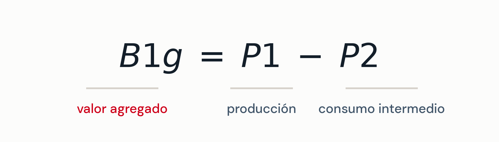
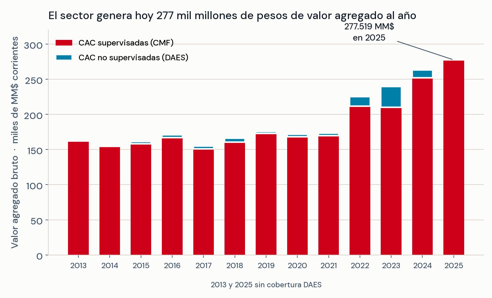
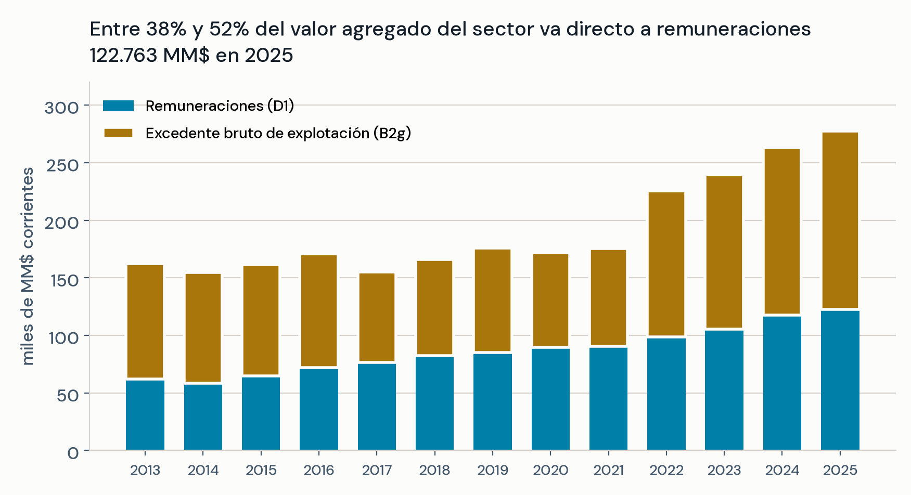
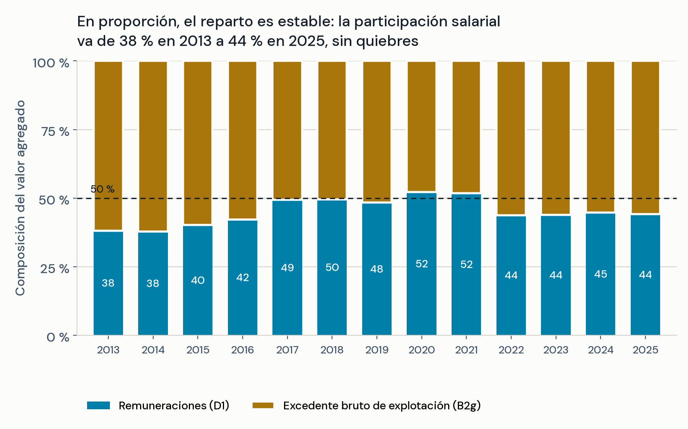
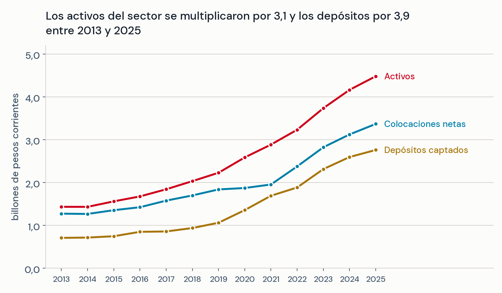
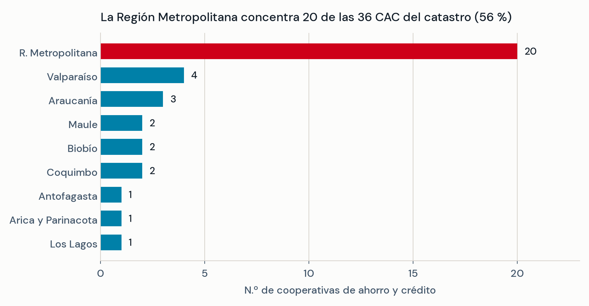
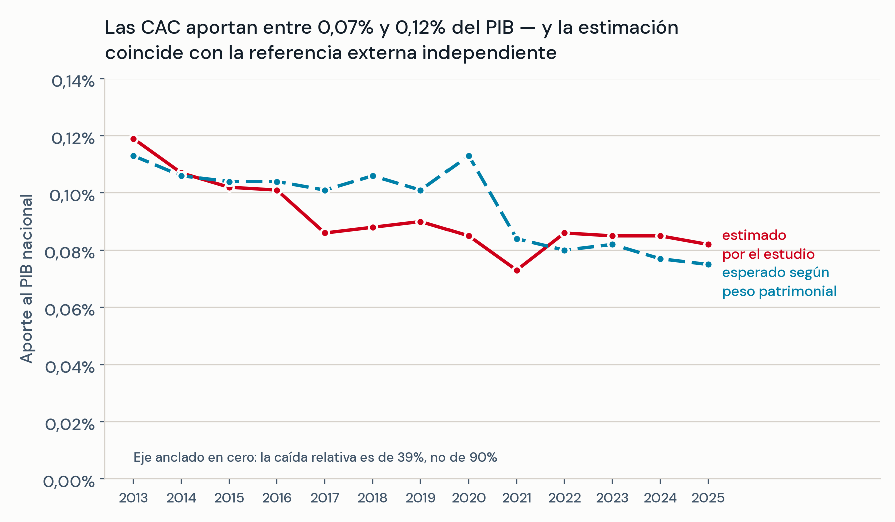
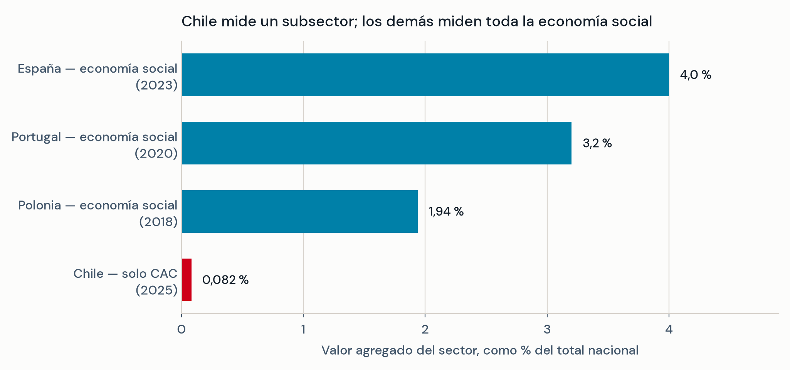
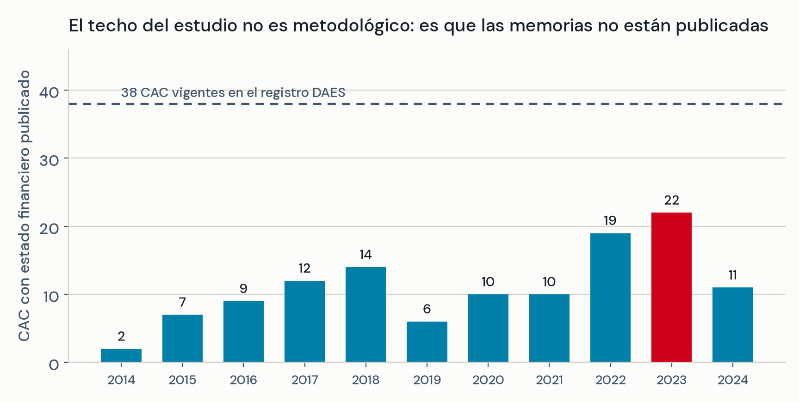
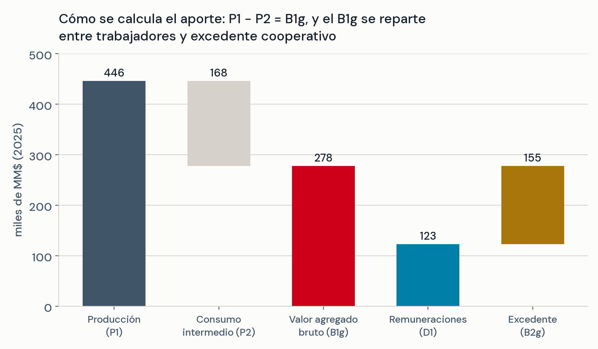

## Agenda

```{=latex}
\tableofcontents
```

::: {.content-visible when-format="revealjs"}
1. Marco general: qué es una cuenta satélite y qué exige
2. Caso de aplicación: las cooperativas de ahorro y crédito
3. De dónde salen los datos
4. El sector en cifras
5. Resultados y hallazgos
6. Qué falta — y qué puede hacer el sector
:::

::: {.notes}
30 minutos: 7' marco general · 5' el caso y sus datos · 6' cifras · 6' hallazgos
· 3' agenda. Dejar 10' de preguntas.

El marco general (bloque 1) es transferible a cualquier organización sin ánimo
de lucro; los bloques 2 a 6 son el caso CAC desarrollado por Ureta & Ruiz Tagle.
:::

# Marco general: cuentas satélite para organizaciones sin ánimo de lucro

## El problema: un sector que produce valor y no aparece

::: {.callout-important title="La economía social es invisible para las cuentas nacionales"}
Cooperativas, mutuales, fundaciones y asociaciones producen bienes y servicios,
emplean trabajadores y generan valor agregado — pero el Sistema de Cuentas
Nacionales **no las aísla como sector**. Sus cifras quedan repartidas dentro de
las actividades económicas convencionales.
:::

Consecuencias prácticas:

- No hay línea base contra la cual evaluar ninguna política dirigida al sector
- Cada gremio produce sus propias cifras, con metodologías no comparables
- Chile no puede contrastarse con países que ya miden su economía social

::: {.aside-text}
No es un problema de falta de datos: es que los datos existentes no están
organizados bajo un marco contable común.
:::

## Qué es una cuenta satélite

::: {.callout-note title="Definición operativa"}
Una **cuenta satélite** es una extensión del Sistema de Cuentas Nacionales que
aísla y mide un sector que las cuentas centrales no distinguen por sí solas,
usando **las mismas definiciones y reglas contables** que el PIB.
:::

:::: {.columns}
::: {.column width="50%"}
**Ya existen para:**

- Turismo
- Salud
- Trabajo no remunerado
- Economía social y sin fines de lucro
:::
::: {.column width="50%"}
**Lo que aporta el "satélite":**

- Cifra comparable internacionalmente
- Serie temporal, no fotografía
- Método auditable y replicable
:::
::::

::: {.aside-text}
Satélite significa que orbita las cuentas nacionales: usa sus reglas, pero
mira un objeto que ellas no enfocan.
:::

## Los tres manuales que definen las reglas

| Marco | Origen | Qué aporta |
|:--|:--|:--|
| **SCN 2025** | Naciones Unidas | Define producción, valor agregado y su lugar en el PIB |
| **Manual ONU-TSE** (2018) | Naciones Unidas | Adapta el SCN a organizaciones de la economía social |
| **Manual CIRIEC** (2007) | CIRIEC / Comisión Europea | Define qué organización entra y cuál no |

::: {.aside-text}
Los tres convergen en un mismo núcleo de cinco variables. Esa convergencia es lo
que permite que una cifra nacional sea comparable con la europea.
:::

## La ecuación central

{width=66%}

::: {.aside-text}
Ecuaciones 4.1–4.3 de la memoria; notación del SCN 2025.
:::

::: {.callout-note title="Las cinco variables del núcleo común"}
**P1** = todo lo que la organización ingresa por su operación.
**P2** = lo que le compra a terceros para operar.

**B1g** = lo que la organización *agrega* con su propio trabajo — eso, y solo eso,
entra al PIB. Se reparte entre remuneraciones (**D1**) y excedente (**B2g**).
:::

## El cuello de botella es siempre el mismo: P2

::: {.callout-important title="Dónde se traba toda aplicación"}
P1, D1 y los stocks salen de los estados financieros. **P2 casi nunca es
observable**: las organizaciones sin ánimo de lucro suelen estar exentas de los
impuestos cuya declaración lo revelaría.
:::

| País | Cómo resuelve la captura de datos |
|:--|:--|
| **España** | Impuesto sobre Sociedades + cotizaciones a seguridad social |
| **Portugal** | Información Empresarial Simplificada (IES) |
| **Polonia** | Encuesta sectorial SOF/ES-S + declaración CIT-8 |
| **Chile** | Registros administrativos dispersos; **sin encuesta al sector** |

: {tbl-colwidths="[16,84]"}

::: {.aside-text}
Sin declaración desagregada, el SCN admite estimar P2 con un coeficiente técnico
de la Matriz Insumo-Producto. Es la salida que toma el caso que sigue.
:::

# Caso de aplicación: las cooperativas de ahorro y crédito en Chile

## Por qué las CAC como caso piloto

::: {.callout-tip title="El subsector con mejores datos disponibles"}
Dentro de la economía social chilena, las cooperativas de ahorro y crédito son
las que **más información publican**: siete están supervisadas por la CMF con
estados financieros auditados, y el resto publica memorias anuales en el portal
DAES.
:::

Eso las hace el banco de pruebas natural: si el método no funciona aquí, no va a
funcionar en subsectores con menos información.

::: {.callout-note title="Autoría del caso"}
La aplicación que se presenta a continuación corresponde a la memoria de título
de **Ignacio Ureta y Antonio Ruiz Tagle** (Ingeniería Civil Industrial, FICA
UANDES, 2026), desarrollada en el marco del proyecto Huella Social.
:::

## Lo que el caso entrega hoy

::: {.callout-tip title="Primer resultado"}
En 2025 las CAC chilenas generaron **277.519 millones de pesos** de valor agregado
bruto — equivalente al **0,082 % del PIB nacional** — y destinaron
**122.763 millones** directamente a remuneraciones.
:::

Y tres cosas más que la cifra:

1. Una **serie de 13 años** (2013–2025), no una fotografía
2. Un **método replicable** y documentado, alineado a los tres manuales
3. Un **tablero público** que permite verificar cada número, entidad por entidad

::: {.aside-text}
Todas las cifras que siguen son **cotas inferiores**: el aporte real es mayor,
por una razón de cobertura que se aborda más adelante.
:::

## El nudo metodológico: nadie sabe cuánto compran las CAC

::: {.callout-important title="La exención tributaria tiene un costo estadístico"}
El artículo 78 del DFL N.º 5/2003 exime a las cooperativas del impuesto de primera
categoría. Excelente para el sector — pero **elimina el registro** que en España y
Portugal se usa para conocer los costos de operación.
:::

Solución adoptada, admitida por el SCN cuando no hay declaración desagregada:

::: {.callout-tip title="El coeficiente técnico"}
**P2 = α × P1**,  con  **α = 0,3776** — el coeficiente del sector 94
(Intermediación financiera) de la **Matriz Insumo-Producto 2018 del Banco Central**.
:::

::: {.aside-text}
Verificado de forma independiente contra el archivo fuente del Banco Central.
:::

## Qué supone ese coeficiente — y dónde falla

:::: {.columns}
::: {.column width="52%"}
**El supuesto:** la estructura de costos de una CAC se parece al promedio del
sector financiero.

**Se aplica igual a los dos segmentos** para que los resultados sean comparables
entre sí.
:::
::: {.column width="48%"}
::: {.callout-note title="Indicio de heterogeneidad"}
La revisión de los estados financieros auditados sugiere que las razones reales
P2/P1 **se apartan del promedio sectorial en ambas direcciones**, según la
entidad.
:::
:::
::::

::: {.callout-tip title="Lectura honesta"}
Esto es una estimación de **orden de magnitud**, no una medición exacta.
Cuantificar esa dispersión y recalibrar α es la primera mejora pendiente: exige
un desglose de gastos que hoy solo permite un puñado de entidades supervisadas.
:::

# De dónde salen los datos

## Tres fuentes públicas, ningún dato levantado a mano

| Fuente | Entidades | Período | Qué aporta |
|:--|:--|:--|:--|
| **DAES** (Min. Economía) | 35 CAC | 2014–2024 | Estados financieros en PDF, memoria por memoria |
| **CMF** | 7 CAC | 2013–2025 | Estados financieros auditados + plataforma BEST |
| **SII** | 12 CAC | complementario | Trabajadores y tramo de ventas por RUT |

: **Cuadro 1** = Cuadro 4.1 de la memoria. {tbl-colwidths="[24,14,17,45]"}

::: {.callout-note title="Todo el insumo es información pública"}
Ningún dato reservado ni encuesta: se construye sobre lo que las cooperativas
**ya publican**.
:::

## Un sector partido en dos por la regulación

:::: {.columns}
::: {.column width="50%"}
::: {.callout-tip title="Segmento CMF — 7 CAC"}
- Patrimonio sobre 400.000 UF
- Supervisión equivalente a la bancaria
- EEFF auditados y publicados
- **Cobertura completa 2013–2025**
:::
:::
::: {.column width="50%"}
::: {.callout-note title="Segmento DAES — 35 CAC"}
- Registro del Ministerio de Economía
- Memorias anuales en PDF
- Formatos heterogéneos
- **Cobertura variable: 2 a 22 por año**
:::
:::
::::

::: {.aside-text}
Panel total: **42 CAC** con dato financiero en al menos un año — 213 observaciones
cooperativa × año. El corte lo fija el patrimonio: sobre 400.000 UF la CAC pasa a
supervisión CMF (DFL N.º 5/2003). Por eso las series DAES se cortan entre 2017 y
2019: las cooperativas grandes migraron de segmento, no desaparecieron.
:::

## Cómo se construyó el panel

1. **Delimitar el universo** — registro DAES, validado con el archivo maestro de
   personas jurídicas del SII (subtipo 817 = CAC)
2. **Cruzar por RUT** las cinco fuentes en un solo registro institucional
3. **Extraer** P1, D1, activos, patrimonio, depósitos y colocaciones de cada
   estado financiero
4. **Depurar** duplicados de carga (133 → 122 observaciones de P1 en DAES)
5. **Estimar** P2, B1g y B2g, y agregar por año

::: {.callout-note title="Sin imputación"}
Si una cooperativa no publicó su memoria de un año, ese año simplemente **no está**
en el panel. No se rellena, no se interpola, no se proyecta. Es la decisión más
conservadora posible — y la razón por la que todas las cifras son pisos.
:::


## Control de calidad: el dato pasó por una auditoría independiente

::: {.callout-tip title="Parte del método, no un resultado"}
Antes de publicar cifras, se sometieron a una auditoría de datos completa:
revisión aritmética de los nueve cuadros de resultados, recálculo desde los
archivos fuente, y verificación de α contra la Matriz Insumo-Producto original
del Banco Central.
:::

- Un error aritmético detectado, corregido **en la fórmula fuente** y verificado de
  forma independiente en las tres capas: texto, dato y tablero público
- Cero errores adicionales en los ocho cuadros restantes
- Registro de decisiones metodológicas público y fechado

::: {.aside-text}
Para un sector que quiere usar estas cifras ante la autoridad, la trazabilidad
del número importa tanto como el número.
:::

## Lo que todavía no se puede medir en Chile

| Variable | Por qué no se puede |
|:--|:--|
| Cuotas y aportes de socios (MDR) | Solo público para las 7 CAC de CMF |
| Empleo en jornada completa (PEF) | El SII reporta solo número de personas |
| Horas trabajadas (PEH) | Sin microdatos de jornada públicos |
| Trabajo voluntario (VOV) | Chile no tiene encuesta de uso del tiempo |
| Depreciación uniforme (B1n) | CMF consolida gastos de apoyo sin desglose |

: **Cuadro 2** = Cuadro 4.6 de la memoria.

::: {.aside-text}
Costa Rica, México, Polonia y Portugal capturan estas variables con **encuestas
creadas para ese fin**. Chile no tiene ninguna. Ésa es la brecha estructural.
:::

# El sector en cifras

## La escala: dos mundos dentro del mismo sector

| Segmento | Producción media | Mediana | Máximo |
|:--|--:|--:|--:|
| **CMF** (7 CAC) | 42.668 | 9.393 | 359.492 |
| **DAES** (35 CAC) | 828 | 392 | 10.774 |

: **Cuadro 3** = Cuadro 4.2 de la memoria.

::: {.callout-important title="Dos asimetrías, no una"}
**Entre segmentos:** la producción media de una CAC supervisada es **50 veces**
la de una no supervisada.

**Dentro del segmento CMF:** la mediana de activos es apenas el **15 % de la
media** — Coopeuch domina el segmento supervisado.
:::

::: {.aside-text}
Cifras en MM\$ corrientes; la media sobre la mediana indica concentración.
:::

## El valor agregado del sector, 2013–2025



::: {.aside-text}
**Figura 1** — elaborada desde los Cuadros 5.2, 5.5 y 5.7 de la memoria.
El segmento CMF explica más del 90 % del valor agregado. El salto de 2022–2023
refleja en parte más cooperativas DAES en el panel, no solo crecimiento real.
:::

## A dónde va ese valor agregado



::: {.aside-text}
**Figura 2** — Cuadro 5.7 de la memoria. En niveles: ambos componentes crecen.
:::

## …y en qué proporción se reparte



::: {.aside-text}
**Figura 3** — Cuadro 5.7 de la memoria, normalizado a 100 %. Responde la
pregunta que la Figura 2 no puede: de cada 100 pesos de valor agregado, cuántos
van a remuneraciones y cuántos quedan como excedente.
:::

## El balance: activos, depósitos y colocaciones



::: {.aside-text}
**Figura 4** — Cuadro 5.8 de la memoria.
Las colocaciones son entre 68 % y 90 % de los activos: el sector es,
estructuralmente, un sector de crédito a sus socios.
:::

## Dónde están las cooperativas



::: {.aside-text}
**Figura 5** — corresponde a la Figura 5.3 de la memoria.
El segmento DAES pesa poco en stocks agregados, pero es el que sostiene la
cobertura territorial fuera de la Región Metropolitana.
:::

# Resultados y hallazgos

## El aporte al PIB — y su validación independiente



::: {.aside-text}
**Figura 6** — Cuadros 5.7 y 5.9. Aporte esperado = "Servicios financieros" en el
PIB (BCCh) × **2,41 %** de peso patrimonial (CMF, *Informe del Desempeño del
Sistema Bancario y Cooperativas*, dic. 2025).
:::

## ¿Es mucho o poco? Contraste de órdenes de magnitud



::: {.aside-text}
**Figura 7** — sin equivalente en la memoria; elaborada para esta presentación.
España: INE, *Cuenta Satélite de la Economía Social* (2026). Portugal: INE &
CASES, *Conta Satélite da Economia Social 2019/2020*. Polonia: Statistics Poland
(2021).
:::

## La comparación correcta es contra lo que Chile todavía no mide

::: {.callout-important title="No son cifras equivalentes"}
España, Portugal y Polonia miden **toda su economía social**; Chile midió **un
solo subsector**. La distancia entre 0,082 % y 4 % no mide tamaño económico:
mide cuánto se ha medido.
:::

::: {.callout-tip title="El contraste que sí es válido, dentro del sistema financiero chileno"}
Servicios financieros, sector completo: **3,1 % del PIB** (BCCh, 2025).

Cooperativas de ahorro y crédito: **0,082 % del PIB** — es decir, un **2,6 %**
del valor agregado financiero del país.
:::

::: {.aside-text}
Cuadro 5.7 de la memoria y BCCh, Cuentas Nacionales. La CMF, por vía
independiente, atribuye a las cooperativas un **2,41 %** del patrimonio del
sistema bancario y cooperativo (*Informe del Desempeño del Sistema Bancario y
Cooperativas*, dic. 2025): dos mediciones que coinciden.
:::

## Hallazgo 1 — La caída del aporte no es una caída del sector

::: {.callout-note title="Lo que dice la Figura 6 (aporte al PIB)"}
La línea roja del aporte estimado baja de 0,119 % en 2013 a 0,082 % en 2025.
:::

::: {.callout-tip title="Lo que realmente ocurrió"}
El valor agregado de las CAC **creció 71 % en términos nominales**. Lo que pasa es
que el PIB de Chile creció más rápido. El sector no se contrajo: creció más lento
que la economía.
:::

::: {.aside-text}
Distinción crítica para el uso público de la cifra: una caída de participación
relativa no es evidencia de deterioro sectorial, y presentarla así sería un
autogol comunicacional.
:::

## Hallazgo 2 — El sector es un empleador estable

- **122.763 MM\$** en remuneraciones en 2025, creciendo todos los años de la serie
- Participación salarial entre **0,38 y 0,52** durante trece años, sin quiebres
- El crecimiento reciente del valor agregado se explica más por excedente que por
  masa salarial

::: {.callout-tip title="Argumento disponible para el gremio"}
La estabilidad de la participación salarial es un dato duro sobre el
comportamiento del sector en crisis (2019–2020 incluidas) que hoy nadie más
puede documentar con serie propia.
:::

## Hallazgo 3 — La concentración es estructural

:::: {.columns}
::: {.column width="50%"}
- 7 cooperativas: **> 90 %** del valor agregado
- 7 cooperativas: **> 95 %** de los activos
- 35 cooperativas: el resto
:::
::: {.column width="50%"}
::: {.callout-note title="Pero"}
El segmento DAES es marginal en stocks y **decisivo en cobertura territorial y
acceso financiero** para poblaciones que las grandes no atienden.
:::
:::
::::

::: {.aside-text}
Consecuencia para el gremio: una cifra única de "aporte del sector" invisibiliza
al segmento que más justifica una política pública diferenciada. Conviene siempre
reportar el desglose.
:::

## Hallazgo 4 — Todas las cifras son pisos, no techos



::: {.aside-text}
**Figura 8** — Cuadro 5.1 de la memoria.
Ningún año cubre las 38 CAC vigentes; el mejor (2023) llega a 22. Cada memoria no
publicada es valor agregado real que no entra en la cifra.
:::

# Qué falta — y qué puede hacer el sector

## Las cuatro limitaciones que hay que declarar siempre

1. **Cobertura parcial del segmento DAES** — el panel nunca cubre el universo
   completo en un mismo año
2. **Consumo intermedio uniforme** — un solo α para cooperativas de tamaños
   muy distintos
3. **Segmentos no comparables en el tiempo** — DAES cubre 2014–2024, CMF 2013–2025;
   la suma es aproximación de orden de magnitud
4. **Sin dato de empleo para 26 CAC** — impide calcular productividad laboral
   sectorial

::: {.callout-note title="Por qué decirlo en voz alta"}
Estas limitaciones no debilitan la cifra: la hacen defendible. Un número presentado
sin sus supuestos es un número que el primer contradictor desarma.
:::

## Tres cosas que el gremio puede cambiar — y que el investigador no

::: {.callout-important title="1. Publicación oportuna de memorias"}
La cobertura de 2024 cae a 11 CAC por memorias no publicadas. Un acuerdo gremial
de publicación en plazo **sube la cifra sin cambiar una línea de metodología**.
:::

::: {.callout-important title="2. Formato común de estado de resultados"}
Una plantilla mínima común (P1, D1, depreciación, depósitos, colocaciones)
automatiza la actualización anual.
:::

::: {.callout-important title="3. Un dato de empleo"}
Trabajadores y jornada: la variable que hoy bloquea el indicador de productividad
sectorial — y la más fácil de aportar.
:::

## La agenda técnica pendiente

| Línea | Qué resuelve |
|:--|:--|
| Estimar P2 directo para las CAC con desglose | Reemplaza el supuesto de α uniforme |
| Análisis de sensibilidad de α (±10–20 %) | Comunica el rango de incertidumbre |
| Ponderar las CAC que sí reportan, para representar a las que no | Convierte el piso en estimación del universo |
| Encuesta sectorial (cuotas, empleo, voluntariado) | Cierra la brecha con España y Portugal |
| Tablero con actualización periódica | Convierte el estudio en monitoreo continuo |

::: {.aside-text}
*Ponderar*: si en un año reportan 11 de 38 CAC, cada una cuenta por más de una
para estimar el universo, como en una encuesta por muestreo. Hoy se suma solo lo
observado, y por eso la cifra es un piso. Las dos últimas líneas requieren al
sector como contraparte activa.
:::

## Hacia una cuenta satélite de la economía social

::: {.callout-tip title="Del caso particular al marco general"}
Las CAC fueron el caso piloto porque son el subsector con **mejores datos
disponibles**. Lo que se probó aquí no es una cifra: es que **el método funciona
con registros administrativos chilenos**, y por tanto es extensible a cooperativas
de trabajo y servicios, mutuales, fundaciones y asociaciones.
:::

Lo que cambia al pasar a otros subsectores:

- **P1 y D1** siguen saliendo de estados financieros — misma lógica
- **P2** se vuelve más difícil: menos entidades con contabilidad auditada
- Aparecen variables que las CAC no tienen: **voluntariado, donaciones, cuotas**
- Sin encuesta sectorial, esas variables seguirán en cero — como hoy

## Para llevarse

::: {.callout-tip title="Cuatro frases utilizables desde mañana"}
**1.** Las cooperativas de ahorro y crédito chilenas generan **277.519 millones de
pesos** de valor agregado al año — **0,082 % del PIB** — con **4,5 billones en
activos** y **3,4 billones colocados** en sus socios.

**2.** Esa cifra está construida con la metodología de **Naciones Unidas**, es
comparable internacionalmente, y fue verificada contra una fuente externa
independiente.

**3.** Es un **piso**, no un techo — y la distancia entre el piso y la cifra real
depende de cuánto publique el propio sector.

**4.** El método es **transferible**: lo que se validó en las CAC sirve para medir
al resto de la economía social chilena.
:::

## Referencias — marcos y aplicaciones nacionales

**Marcos metodológicos**

- United Nations, European Commission, IMF, OECD & World Bank (2025).
  *System of National Accounts 2025* (ST/ESA/STAT/SER.F/2/Rev.6).
- Naciones Unidas (2018). *Satellite Account on Non-profit and Related
  Institutions and Volunteer Work*. Studies in Methods, Series F, N.º 91, Rev. 1.
- Barea Tejeiro, J. & Monzón Campos, J. L. (2007). *Manual para la elaboración de
  las cuentas satélite de las empresas de la economía social*. CIRIEC.

**Aplicaciones nacionales citadas**

- Pedroso, E., Neves, E., Ramos, C. & Rodrigues, C. (2023). *Conta Satélite da
  Economia Social 2019/2020*. CASES & INE, Lisboa. — **Portugal**
- Statistics Poland (2021). *Social Economy Satellite Account for Poland 2018*.
  Varsovia. — **Polonia**
- Instituto Nacional de Estadística (2026). *Cuenta Satélite de la Economía
  Social, serie 2019–2023*. Madrid. — **España, cifra de contraste**

## Referencias — normativa y fuentes de datos

**Normativa chilena**

- Ministerio de Economía (2003). *DFL N.º 5, Ley General de Cooperativas* —
  art. 78 (exención) y umbral de 400.000 UF para supervisión CMF.
- Ley N.º 21.641 de Resiliencia Financiera (2023).
- Leyes N.º 19.862 (transferencias públicas) y N.º 19.885 (donaciones).

**Fuentes de datos**

- Banco Central de Chile (2026). *PIB por clase de actividad económica*;
  *Matriz Insumo-Producto 2018*, actividad 94.
- CMF (2025). *Informe del Desempeño del Sistema Bancario y Cooperativas*, dic.
- DAES (registro y memorias anuales) y SII (archivo maestro de personas jurídicas).

**Caso de aplicación**

- Ureta, I. & Ruiz Tagle, A. (2026). *Propuesta metodológica para una cuenta
  satélite de las cooperativas de ahorro y crédito en Chile*. Memoria de título,
  Universidad de los Andes.

# Anexos

## Anexos — material de respaldo

::: {.callout-note title="Qué son estas láminas"}
Lo que sigue **no se expone**: son láminas de respaldo, para responder preguntas
sin tener que improvisar una cifra o un supuesto.
:::

Contenido:

1. **De los ingresos al aporte al PIB** — la cascada P1 → P2 → B1g → D1 + B2g,
   con las cifras de 2025
2. **Nota sobre los gráficos** — criterios de diseño y cómo se generan

La trazabilidad de cada cifra hasta su cuadro de origen está en la lámina 15, y
las referencias bibliográficas completas en las láminas 33 y 34.

## De los ingresos al aporte al PIB



::: {.aside-text}
**Figura 9** — Cuadro 5.7 de la memoria, fila 2025. Cifras en MM\$ corrientes.
El valor agregado se reparte entre remuneraciones (D1) y el excedente que queda
para socios y reservas (B2g).
:::

## Fuentes de los datos presentados

| Cifra | Cuadro de origen |
|:--|:--|
| VAB por segmento y total | Cuadros 5.2, 5.5 y 5.7 |
| Aporte al PIB | Cuadro 5.7; PIB: BCCh, Cuentas Nacionales Anuales |
| Cuenta financiera agregada | Cuadro 5.8 |
| Cobertura del panel DAES | Cuadro 5.1 |
| Estadística descriptiva | Cuadro 4.2 |
| Validación externa | Cuadro 5.9; CMF (dic-2025) y BCCh |
| α = 0,3776 | MIP 2018 BCCh, actividad 94 |

::: {.aside-text}
Cada cifra de esta presentación es rastreable hasta un cuadro de la memoria.
Referencias completas al cierre.
:::

## Nota sobre los gráficos

Todos los gráficos de esta presentación se generan desde
`gen_figuras.py`, directamente a partir de los cuadros de resultados de la memoria.

Criterios aplicados:

- **Un solo eje por gráfico** — nunca doble eje, que exagera o disimula
  divergencias entre series
- **Ejes de porcentaje anclados en cero** — la caída del aporte al PIB es de 39 %,
  no del 90 % que sugiere un eje truncado
- **Paleta verificada para daltonismo** (protanopia, deuteranopia, tritanopia) y
  con contraste suficiente para proyección
